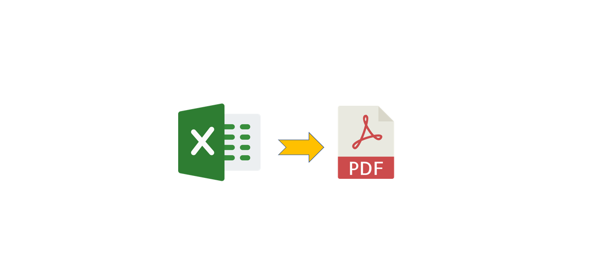

# XLSX to PDF Converter
Convert any XLSX file to PDF file using python 3.x.

## 1. Setup the environment
    conda create -n xlsxToPDF python=3.7

## 2. Activate the environment in command prompt
    conda activate xlsxToPDF

## 3. Installation and Setup:
    pip install pywin32

## 4. To Run the xlsxToPDF.py file:-
    python xlsxToPDF.py -inp input_filename.xlsx -pg num_of_pg
e.g. a demo in this case:-

    python xlsxToPDF.py -inp Calendar.xlsx -pg 12
    
## 5. For custom output filename as PDF, the format is :-
    python xlsxToPDF.py -inp input_filename.xlsx -out output_filename.pdf -pg num_of_pg
e.g. a demo in this case:-

    python xlsxToPDF.py -inp Calendar.xlsx -out NewCalendar.pdf -pg 12
    

